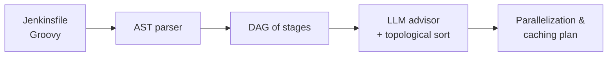
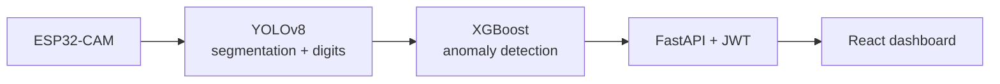

<div align="center">

# ⚡ `SARRA_BAHLOUS.sys` ⚡
### `[Computer Science Engineer @ ENSI | Edge AI & Autonomous Systems]`

<br/>


<br/><br/>

[](https://git.io/typing-svg)

<br/>

[](https://linkedin.com/in/sarra-bahlous)
[](https://kaggle.com/sarra1011)
[](mailto:sarra.bahlous@ensi-uma.tn)

<br/>

```text
========================================================================
🚀 STATUS : Final-year CS Engineering Student @ ENSI (IoT Specialization)
🎯 FOCUS  : Bridging Deep Learning Research with Edge Hardware & Agents
🔥 MISSION: Seeking an AI / Intelligent-IoT Internship Abroad!
========================================================================
```

</div>

<hr/>

### 🛰️ Core Specializations & Domain Focus

<table>
  <tr>
    <td width="50%" valign="top">
      <h4>🤖 Agentic AI & DevOps Automation</h4>
      <p>Autonomous multi-agent systems (LangGraph, CrewAI, RAG) for firmware code analysis, AST DAG graph execution, CI/CD pipeline profiling, and automated incident response.</p>
      <h4>👁️ Computer Vision & Speech AI</h4>
      <p>Domain generalization (CLIP-DRDG), real-time segmentation (YOLOv8), and low-resource code-switched voice agent pipelines with LoRA fine-tuning.</p>
    </td>
    <td width="50%" valign="top">
      <h4>🛡️ Cyber-Physical Systems & SOC Security</h4>
      <p>On-node TinyML, LoRA sensor networks, zero-trust security modeling, anti-spoofing protocols, and ML-powered SIEM anomaly detection with Explainable AI (XAI).</p>
      <h4>🔬 Quantum Computing & Exploration</h4>
      <p>Quantum circuit simulation (Qiskit) exploring superposition, entanglement, elementary gates, Grover’s search, and amplitude amplification algorithms.</p>
    </td>
  </tr>
</table>

---

### 🛠️ Technical Arsenal & Ecosystem

<p align="center">
  <br/>
</p>

<table>
  <tr>
    <td width="26%" valign="middle"><b>💻 Languages</b></td>
    <td width="74%" valign="middle">
      
      
      
      
      
      
      
    </td>
  </tr>
  <tr>
    <td width="26%" valign="middle"><b>🧠 AI / ML / CV</b></td>
    <td width="74%" valign="middle">
      
      
      
      
      
      
      
      
      
    </td>
  </tr>
  <tr>
    <td width="26%" valign="middle"><b>🎙️ Speech AI & Fine-Tuning</b></td>
    <td width="74%" valign="middle">
      
      
      
      
      
      
      
      
    </td>
  </tr>
  <tr>
    <td width="26%" valign="middle"><b>🤖 LLM & Multi-Agent</b></td>
    <td width="74%" valign="middle">
      
      
      
      
      
      
    </td>
  </tr>
  <tr>
    <td width="26%" valign="middle"><b>🗄️ Data & Backend</b></td>
    <td width="74%" valign="middle">
      
      
      
      
      
      
      
      
    </td>
  </tr>
  <tr>
    <td width="26%" valign="middle"><b>⚙️ DevOps & MLOps</b></td>
    <td width="74%" valign="middle">
      
      
      
      
      
      
    </td>
  </tr>
  <tr>
    <td width="26%" valign="middle"><b>📡 IoT, Embedded & Edge</b></td>
    <td width="74%" valign="middle">
      
      
      
      
      
      
    </td>
  </tr>
  <tr>
    <td width="26%" valign="middle"><b>🛰️ Systems & Cyber-Physical</b></td>
    <td width="74%" valign="middle">
      
      
      
      
      
      
      
    </td>
  </tr>
  <tr>
    <td width="26%" valign="middle"><b>⚛️ Quantum Computing</b></td>
    <td width="74%" valign="middle">
      
      
      
    </td>
  </tr>
</table>

---

### 🌌 Detailed Mission Log & Engineering Experience

<table align="center">
  <tr>
    <td align="center"><h3>⏱️ 1h 10min</h3><sub>CI build time cut</sub></td>
    <td align="center"><h3>🎯 99.82%</h3><sub>meter segmentation accuracy</sub></td>
    <td align="center"><h3>🗣️ 12.9 h</h3><sub>code-switched speech for LoRA</sub></td>
    <td align="center"><h3>🌐 4 domains</h3><sub>retinopathy generalization</sub></td>
  </tr>
</table>

<br/>

<details open>
  <summary><b>🏢 01. Autonomous AI Agents for Firmware CI/CD — STMicroelectronics</b></summary>
  <br/>
  <p></p>
  <p><b>Role:</b> AI/DevOps Engineering Intern | Embedded Software Department, DevOps Team</p>
  <p><b>The challenge:</b> firmware pipelines are long, hard to maintain, and slow to ship. I built agents that read the pipeline, understand it, and improve it.</p>



  <ul>
    <li>🧠 <b>Multi-agent system:</b> LangGraph + CrewAI + RAG to parse firmware source code, analyze pipeline architecture, and assist DevOps engineers in maintenance and continuous delivery.</li>
    <li>⚡ <b>Pipeline optimization engine:</b> graph-based parser turning Groovy AST into DAGs; an LLM advisor combined with rule-based topological sorting recommends parallelization and artifact caching, <b>cutting build times by 1h 10min</b>.</li>
    <li>🛠️ <b>Agents across the lifecycle:</b>
      <ul>
        <li><i>Quality & Code Review:</i> automated static analysis and firmware quality checks.</li>
        <li><i>Compilation & Validation:</i> intelligent job execution and dependency management.</li>
        <li><i>Infra & Job Monitoring:</i> real-time pipeline health, early incident detection, proactive alerts.</li>
      </ul>
    </li>
    <li>🔄 <b>Jenkins → GitHub Actions migration:</b> QA-stage agent for migrating a Gerrit-integrated pipeline (<b>8 top-level stages, 32 shared-library steps</b>) to GitHub Actions on self-hosted runners.</li>
  </ul>
  <p>


</p>
</details>

<details>
  <summary><b>🎙️ 02. Real-Time Voice Agent for Tunisian Derja-French Code-Switching</b></summary>
  <br/>
  <p></p>
  <p><b>The challenge:</b> public-utility callers switch between Derja and French mid-sentence, on noisy phone lines, and expect to interrupt the agent like they would a human.</p>
  <ul>
    <li>📞 <b>Low-latency telephony engine:</b> end-to-end real-time agent for utility queries (leaks, billing, outages) with decoupled STT / LLM / TTS stages and barge-in support.</li>
    <li>📊 <b>Speech benchmark:</b> Whisper vs Deepgram vs ElevenLabs under clean vs noisy phone-line conditions.</li>
    <li>🔧 <b>LoRA post-correction workflow:</b> fine-tuning on <b>12.9 hours</b> of code-switched Tunisian speech using Hugging Face and Kaggle GPUs.</li>
  </ul>
  <p>


</p>
</details>

<details>
  <summary><b>🌊 03. AquaSense — Smart Water Monitoring System</b></summary>
  <br/>
  <p></p>
  <p><b>The challenge:</b> read water meters from a cheap camera and flag abnormal consumption automatically.</p>



  <ul>
    <li>🔬 <b>Dual-model pipeline:</b> YOLOv8 (<b>99.82%</b> segmentation, <b>88.12%</b> digit reading) feeding an XGBoost anomaly detector (<b>90.38%</b> accuracy, six anomaly categories) calibrated on national water-utility standards.</li>
    <li>🚀 <b>Production stack:</b> FastAPI REST backend with JWT authentication and an interactive React dashboard.</li>
  </ul>
  <p>


</p>
</details>

<details>
  <summary><b>🛡️ 04. TrustFire — Trustworthy Low-Cost IoT Wildfire Detection</b></summary>
  <br/>
  <p></p>
  <p><b>The challenge:</b> a wildfire sensor network must never cry wolf, and must not be fooled by an attacker.</p>
  <ul>
    <li>🔥 <b>Edge TinyML:</b> solar-powered LoRa sensor network with on-node smoke/fire classification and time-windowed <b>k-of-n multi-node fusion</b> to eliminate false positives.</li>
    <li>🔐 <b>Zero-trust security layer:</b> authenticated messaging, anti-replay protection, heartbeat failure detection, tested against active spoofing and tampering attacks.</li>
  </ul>
  <p>


</p>
</details>

<details>
  <summary><b>🏥 05. Medical Imaging AI for Diabetic Retinopathy — LARODECK Lab</b></summary>
  <br/>
  <p></p>
  <p><b>The challenge:</b> a model trained on one hospital's retinal scans often fails on another's.</p>
  <ul>
    <li>🌍 <b>Domain generalization:</b> extended CLIP-DRDG (CoOpLVT), a vision-language framework, for DR grading across <b>4 clinical domains</b> (APTOS, EyePACS, Messidor, Messidor-2).</li>
    <li>⚖️ <b>Class imbalance:</b> focal loss, class-balanced weighting, label smoothing and fundus-specific augmentations for robustness on rare severe grades.</li>
  </ul>
  <p>


</p>
</details>

<details>
  <summary><b>🛡️ 06. AI-Based SOC Anomaly Detection System</b></summary>
  <br/>
  <p></p>
  <ul>
    <li>🕵️ <b>ML intrusion detection</b> integrated with Wazuh SIEM to spot suspicious authentication patterns and attack behaviors.</li>
    <li>💡 <b>Explainable AI layer</b> producing interpretable alerts so SOC analysts can see why something was flagged.</li>
  </ul>
  <p>


</p>
</details>

<details>
  <summary><b>⚛️ 07. Quantum Computing Basics — Qiskit Lab</b></summary>
  <br/>
  <p></p>
  <ul>
    <li>🔮 <b>Hands-on Qiskit repo:</b> notebooks on qubits, Bell states and Grover's search, plus a small simulator (gates, circuits) and noise / performance experiments.</li>
    <li>🎯 <b>Next:</b> full Grover implementation, circuit visualizations, simulated quantum measurements.</li>
  </ul>
  <p>


</p>
</details>

---

<div align="center">

📫 **Reach out:** [LinkedIn](https://linkedin.com/in/sarra-bahlous) | [Kaggle](https://kaggle.com/sarra1011) | [Email](mailto:sarra.bahlous@ensi-uma.tn)

</div>
